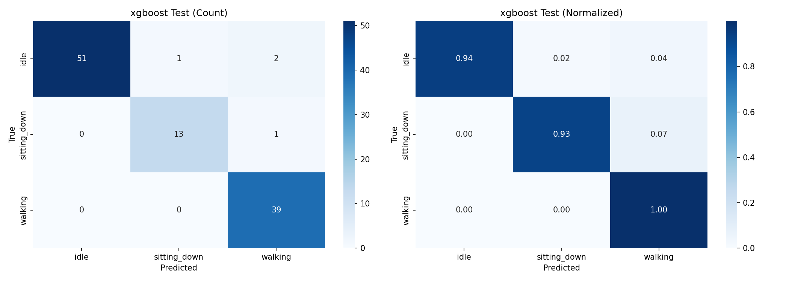
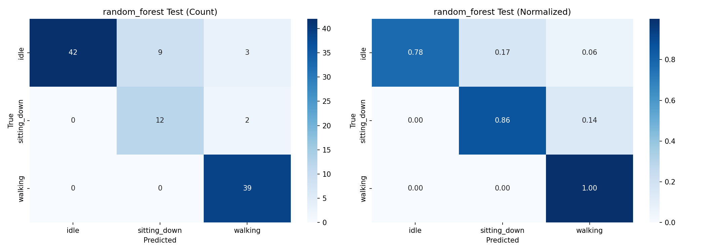
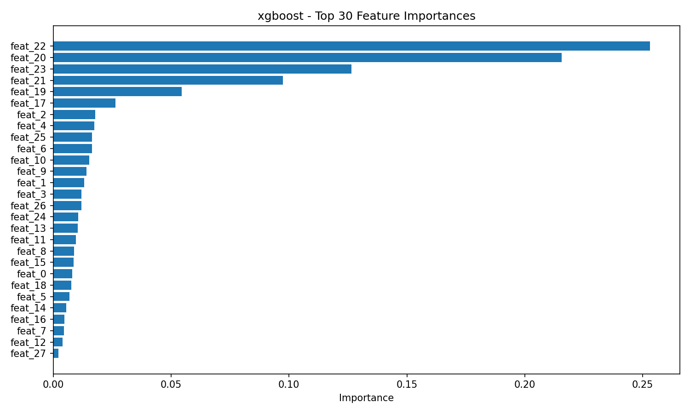
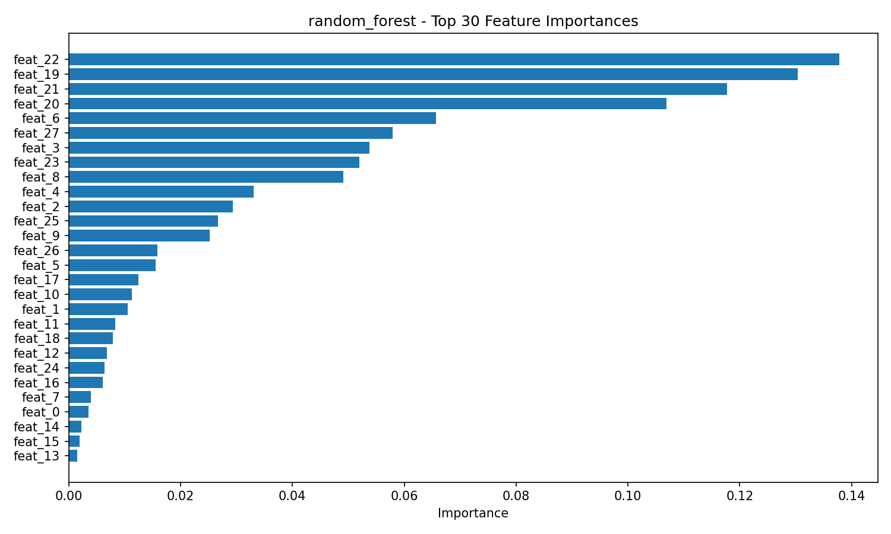

# CSI 动作识别 Baseline（传统机器学习）

基于 XGBoost / Random Forest 的快速 Baseline，用于验证 CSI 数据是否包含可区分的动作信息。

## 依赖安装

```bash
cd Baseline
python3 -m pip install -r requirements.txt
```

## 快速开始

### 1. 确认有采集好的数据

确保 `../CSI_collection_AP_STA/data/` 目录下有多个 CSV 文件，且标签名是动作名（如 `idle`、`walking`、`sitting_down` 等）：

```
node1_idle_20260526_122147.csv
node1_walking_20260526_123015.csv
node1_sitting_down_20260526_123530.csv
...
```

### 2. 修改配置（可选）

编辑 `config.yaml`：
- 如果数据路径不对，修改 `data.csv_paths`
- 如果要做 **Leave-One-Session-Out (LOSO)** 交叉验证，设 `training.loso_cv: true`
- 如果数据量少（只有 1-2 天的 session），设 `training.loso_cv: false`

### 3. 训练

```bash
python3 train_baseline.py
```

输出示例：
```
Found 15 CSV files
Train: 10 files, Val: 3 files, Test: 2 files

[1/3] Processing training set...
[Preprocess] Loading ...
  Valid frames: 3250, features: 64
  [Subcarrier] Kept 52 / 64 features

Feature shape: (48, 37)

==================================================
Training: xgboost
Class weights: {0: 1.0, 1: 1.0, 2: 1.2, 3: 1.2, 4: 3.0}

[Validation] Results:
  Accuracy:      0.8125
  Macro F1:      0.7854
  Macro Prec:    0.7981
  Macro Recall:  0.7912

Classification Report:
              precision    recall  f1-score   support

        idle     0.9167    0.8462    0.8800        13
     walking     0.8000    0.8889    0.8421         9
 sitting_down  0.6667    0.8000    0.7273         5
 standing_up   0.7500    0.6000    0.6667         5
        fall   1.0000    0.5000    0.6667         2

[Test] Results:
  Accuracy:      0.8750
  Macro F1:      0.8235
...

Saved model to output/model_xgboost.pkl
```

### 4. 查看结果

训练完成后，`output/` 目录下会生成：

| 文件 | 说明 |
|---|---|
| `model_xgboost.pkl` | 训练好的 XGBoost 模型 |
| `model_random_forest.pkl` | 训练好的 Random Forest 模型 |
| `cm_xgboost.png` | XGBoost 测试集混淆矩阵 |
| `cm_random_forest.png` | RF 测试集混淆矩阵 |
| `feature_importance_xgboost.png` | XGBoost 特征重要性图 |

模型 `.pkl` 内会保存：

- `model`
- `label_map`
- `norm_stats`，包含训练集拟合出的 `keep_idx`
- `preproc_config`
- `feature_cfg`

预测时必须复用这些信息，不能重新拟合归一化或去零子载波。

### 混淆矩阵怎么看

`cm_xgboost.png` 和 `cm_random_forest.png` 是测试集混淆矩阵。左图是原始数量，右图是按真实类别归一化后的比例。

XGBoost 当前输出示例：



Random Forest 当前输出示例：



读图方式：

- 纵轴 `True`：真实标签。
- 横轴 `Predicted`：模型预测标签。
- 对角线越深、数值越大，说明预测越正确。
- 非对角线代表误判。例如 `True=walking, Predicted=sitting_down` 表示真实 walking 被错判成 sitting_down。
- 左边 `Count` 看具体错了多少个窗口；右边 `Normalized` 看每个真实类别内部的比例。

以上面当前图为例：

- XGBoost：真实 `walking` 一共有 `104` 个测试窗口，其中 `96` 个判成 `walking`，`8` 个误判成 `sitting_down`，walking recall 约为 `0.92`。
- Random Forest：真实 `walking` 一共有 `104` 个测试窗口，其中 `91` 个判成 `walking`，`13` 个误判成 `sitting_down`，walking recall 约为 `0.87`。
- `idle` 和 `sitting_down` 两行全是 `0`，说明当前测试集里没有这两类真实样本；这不是模型完美识别了它们，而是没有被测试到。

因此，这两张图当前只能说明：在这个测试 split 中，模型对 `walking` 大多能识别，但有一部分会混到 `sitting_down`。它不能证明模型已经能可靠区分 `idle`、`sitting_down` 和其他动作。正式评估时，测试集每个类别都应该有样本。

### 特征重要性图怎么看

`feature_importance_xgboost.png` 和 `feature_importance_random_forest.png` 展示的是树模型最常用、最有区分力的手工特征。横轴 `Importance` 越大，说明该特征在模型分裂中贡献越大。

XGBoost 当前输出示例：



Random Forest 当前输出示例：



图里的 `feat_0`、`feat_1` 不是子载波编号，而是手工特征向量里的位置编号。当前配置下对应关系如下：

| 编号 | 特征名 | 含义 |
|---|---|---|
| `feat_0` | `mean_mean` | 各子载波窗口均值，再对所有子载波取均值 |
| `feat_1` | `mean_std` | 各子载波窗口均值，在子载波间的标准差 |
| `feat_2` | `std_mean` | 各子载波时间标准差的均值 |
| `feat_3` | `std_std` | 各子载波时间标准差在子载波间的标准差 |
| `feat_4` | `max_mean` | 各子载波最大值的均值 |
| `feat_5` | `max_std` | 各子载波最大值在子载波间的标准差 |
| `feat_6` | `min_mean` | 各子载波最小值的均值 |
| `feat_7` | `min_std` | 各子载波最小值在子载波间的标准差 |
| `feat_8` | `ptp_mean` | 各子载波峰峰值的均值 |
| `feat_9` | `ptp_std` | 各子载波峰峰值在子载波间的标准差 |
| `feat_10` | `energy_mean` | 各子载波能量的均值 |
| `feat_11` | `energy_std` | 各子载波能量在子载波间的标准差 |
| `feat_12` | `skewness_mean` | 各子载波偏度的均值 |
| `feat_13` | `skewness_std` | 各子载波偏度在子载波间的标准差 |
| `feat_14` | `kurtosis_mean` | 各子载波峰度的均值 |
| `feat_15` | `kurtosis_std` | 各子载波峰度在子载波间的标准差 |
| `feat_16` | `diff_mean` | 相邻帧 CSI 幅度差分绝对值均值 |
| `feat_17` | `diff_std` | 相邻帧 CSI 幅度差分标准差 |
| `feat_18` | `diff_energy` | 相邻帧 CSI 幅度差分能量 |
| `feat_19` | `rssi_mean` | RSSI 均值 |
| `feat_20` | `rssi_std` | RSSI 标准差 |
| `feat_21` | `rssi_ptp` | RSSI 峰峰值 |
| `feat_22` | `rssi_min` | RSSI 最小值 |
| `feat_23` | `rssi_max` | RSSI 最大值 |
| `feat_24` | `corr_mean` | 子载波间相关系数绝对值均值 |
| `feat_25` | `corr_std` | 子载波间相关系数标准差 |
| `feat_26` | `corr_min` | 子载波间相关系数最小值 |
| `feat_27` | `corr_max` | 子载波间相关系数最大值 |

如果 `feat_20`、`feat_21`、`feat_22` 排在最前，说明模型主要依赖 RSSI 波动来区分动作。例如 walking 通常会让整体信号强度波动比 idle 更明显，所以 RSSI 特征容易很强。

这有两层含义：

1. 好消息：当前数据里确实存在可分辨的动作信号。
2. 风险：模型可能学到了采集距离、人体位置、链路强弱等条件差异，而不完全是 CSI 子载波模式。

建议做一次对照实验：把 `config.yaml` 里的 `features.rssi_stats` 改成 `false` 或空列表，只用 CSI 幅度特征重新训练。如果准确率仍然较高，说明 CSI 本身也有稳定区分力；如果准确率大幅下降，说明当前 baseline 主要靠 RSSI。

### 5. 对新文件做预测

```bash
python3 example_predict.py \
  "../CSI_collection_AP_STA/data/node1_walking_20260526_123015.csv" \
  output/model_xgboost.pkl
```

输出：
```
Prediction Result:
  File: ../CSI_collection_AP_STA/data/node1_walking_20260526_123015.csv
  Total windows: 16
  Majority vote: walking (confidence: 87.5%)

Distribution:
  walking: 14 (87.5%)
  idle: 2 (12.5%)
```

---

## 数据质量判断标准

| 指标 | 数据可用 | 需要优化 |
|---|---|---|
| **Test Accuracy** | > 70% | < 60% |
| **Test Macro-F1** | > 65% | < 55% |
| **fall Recall** | > 80% | < 50% |

- 如果 **Accuracy > 70%**：数据有动作信息，可以继续上深度学习模型
- 如果 **Accuracy < 60%**：先不要写复杂模型，先检查采集流程（距离、角度、ping 源唯一性）
- 如果 **fall 经常被误判为 walking**：说明 fall 的"短时剧烈变化"特征不够明显，可能需要更短的窗口或更多 fall 样本

---

## 当前 Baseline 结果示例

当前 `idle / walking / sitting_down` 三分类数据使用 `split_strategy: stratified_label` 后，文件级划分结果为：

```text
idle: total=23, train=16, val=3, test=4
sitting_down: total=6, train=4, val=1, test=1
walking: total=20, train=14, val=3, test=3

Train: 34 files
Val:   7 files
Test:  8 files
```

窗口级样本数量为：

```text
Validation support:
idle          42
sitting_down  14
walking       39
total         95

Test support:
idle          54
sitting_down  14
walking       39
total        107
```

### XGBoost

| Split | Accuracy | Macro F1 | Macro Precision | Macro Recall |
|---|---:|---:|---:|---:|
| Validation | 0.9368 | 0.8853 | 0.9540 | 0.8571 |
| Test | 0.9626 | 0.9543 | 0.9524 | 0.9577 |

Test 分类报告：

| Class | Precision | Recall | F1-score | Support |
|---|---:|---:|---:|---:|
| `idle` | 1.0000 | 0.9444 | 0.9714 | 54 |
| `sitting_down` | 0.9286 | 0.9286 | 0.9286 | 14 |
| `walking` | 0.9286 | 1.0000 | 0.9630 | 39 |
| **weighted avg** | 0.9646 | 0.9626 | 0.9627 | 107 |

### Random Forest

| Split | Accuracy | Macro F1 | Macro Precision | Macro Recall |
|---|---:|---:|---:|---:|
| Validation | 0.9684 | 0.9477 | 0.9762 | 0.9286 |
| Test | 0.8692 | 0.8335 | 0.8193 | 0.8783 |

Test 分类报告：

| Class | Precision | Recall | F1-score | Support |
|---|---:|---:|---:|---:|
| `idle` | 1.0000 | 0.7778 | 0.8750 | 54 |
| `sitting_down` | 0.5714 | 0.8571 | 0.6857 | 14 |
| `walking` | 0.8864 | 1.0000 | 0.9398 | 39 |
| **weighted avg** | 0.9025 | 0.8692 | 0.8738 | 107 |

从这组结果看，当前数据上 XGBoost 明显优于 Random Forest，尤其是 `sitting_down` 和整体 Macro F1。Random Forest 的 `sitting_down` precision 只有 `0.5714`，说明它把不少其他动作误判成了 `sitting_down`。

### 指标含义

| 指标 | 含义 | 怎么看 |
|---|---|---|
| `Accuracy` | 所有窗口中预测正确的比例 | 类别均衡时直观；类别不均衡时可能虚高 |
| `Precision` | 被预测为某类的窗口里，有多少真的是该类 | 低 precision 表示误报多 |
| `Recall` | 某类真实窗口中，有多少被找出来 | 低 recall 表示漏检多 |
| `F1-score` | Precision 和 Recall 的调和平均 | 同时考虑误报和漏检 |
| `Support` | 当前 split 中该类真实窗口数量 | support 太少时该类指标波动会很大 |
| `Macro avg` | 各类别指标简单平均 | 每个类别权重相同，适合看类别不均衡场景 |
| `Weighted avg` | 按 support 加权平均 | 大类影响更大，小类差可能被掩盖 |

优先关注顺序：

1. `Macro F1`：比 Accuracy 更能反映多类别整体效果。
2. 每个类别的 `Recall`：看有没有某个动作经常漏检。
3. 每个类别的 `Precision`：看某个动作是否经常被误报。
4. `Support`：确认 val/test 里每类都有足够样本。

当前 `sitting_down` 的 test support 只有 `14` 个窗口，样本仍偏少。后续应继续增加 `sitting_down`、`standing_up`、`fall` 的独立采集次数。

## 配置速查

### 窗口大小 (`window.size`)

| 值 | 时长 (@87fps) | 适用场景 |
|---|---|---|
| 64 | ~0.7s | fall（极短动作） |
| 128 | ~1.5s | 推荐，通用 |
| 256 | ~3.0s | walking（长动作） |

### 交叉验证方式 (`training.loso_cv`)

| 场景 | 建议 |
|---|---|
| 有 **3 天以上** 的数据 | `true`：做 LOSO，验证跨时间泛化 |
| 只有 **1-2 天** 的数据 | `false`：按文件划分 train/val/test |

### 数据划分方式 (`data.split_strategy`)

| 值 | 说明 | 建议 |
|---|---|---|
| `stratified_label` | 从文件名解析动作标签，每个类别内部按比例切 train/val/test | 快速 baseline 推荐 |
| `session` | 按文件名里的日期/session 划分 | 验证跨 session 泛化时使用 |
| `file` | 按排序后的文件列表直接切分 | 仅临时调试 |

`stratified_label` 需要文件名类似：

```text
node1_idle_20260528_230438.csv
node1_walking_20260528_235109.csv
node1_sitting_down_20260529_000144.csv
```

脚本会把 `idle`、`walking`、`sitting_down` 分别分组，每组内部再按 `split_ratio` 切分，最后合并。这样可以尽量保证 train/val/test 都有每个类别。

### 模型选择 (`models.*.enabled`)

| 模型 | 特点 | 建议 |
|---|---|---|
| XGBoost | 通常效果最好 | **必开** |
| Random Forest | 不易过拟合，可解释 | 对比用 |
| LightGBM | 训练快，需安装 | 可选 |

---

## 与深度学习的关系

Baseline 的目标不是达到最高准确率，而是**快速验证数据可用性**：

```
Baseline Accuracy > 70%  ──►  数据有信号，可以训练 CNN_BiLSTM
Baseline Accuracy < 60%  ──►  先调硬件/采集流程，不要急着上深度学习
```

通常 XGBoost Baseline 能达到 75-85%，而 CNN_BiLSTM 能在此基础上再提升 5-15%。

## 重要注意事项

1. 至少需要 2 个类别才能训练。只有 `idle` 一类时，脚本会只跑预处理和特征提取，然后停止。
2. 标签映射只从训练集建立，验证/测试/预测全部复用同一个 `label_map`。
3. 默认 `split_strategy: stratified_label`，适合快速确认数据是否有信号。
4. 如果要验证跨日期/跨 session 泛化，把 `split_strategy` 改成 `session`，但每个 session 最好都包含完整类别。
5. 当前 Baseline 是单节点文件级 baseline。四节点融合需要先完成节点对齐和拼接，再扩展此脚本。
